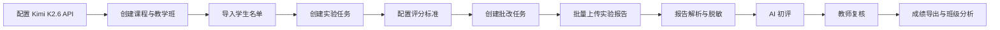

<p align="center">
  
</p>

<p align="center">
  <a href="https://github.com/hrqz007/AIReportGrader/releases/tag/v2.0.1">
    
  </a>
  
  
  
  
</p>

<p align="center">
  <b>让 AI 承担实验报告初评和分项诊断，让教师保留最终成绩确认权。</b>
</p>

---

## 项目简介

**实验智评** 是一个面向高校课程实验报告评阅场景的本地化智能评阅系统。系统支持教师建立课程、教学班、实验任务和评分标准，批量上传学生实验报告，完成报告解析、图片提取、脱敏处理、AI 建议评分、教师复核、成绩导出与班级分析。

它不是学生端平台，也不是自动给最终成绩的系统。它的设计目标是：**减少教师重复性批改劳动，提高反馈结构化程度，同时确保最终成绩由教师确认。**

---

## 快速试用

> 推荐普通教师使用便携版，不需要单独安装 Python、Node.js、npm、Word 或 WPS。

### 下载

[点击下载实验智评 V2.0.1 便携版](https://github.com/hrqz007/AIReportGrader/releases/download/v2.0.1/AIGRADER_V2_PORTABLE_20260524_175034.zip)

### 启动

1. 解压压缩包。
2. 双击 `启动实验智评V2.bat`。
3. 浏览器会自动打开系统。
4. 如果没有自动打开，请手动访问：

```text
http://127.0.0.1:8000
```

运行期间请不要关闭命令行窗口，关闭后系统会停止运行。

---

## 功能总览

| 模块 | 能做什么 | 教学价值 |
|---|---|---|
| 课程与班级 | 管理课程、学期、教学班、班级关联 | 支持多课程、多学期教学组织 |
| 学生名单 | 导入班级名单，维护课程名单副本 | 适配重修、补选、退课等真实情况 |
| 实验与评分 | 创建实验任务，配置分项评分标准 | 让 AI 初评有明确依据 |
| 批改流程 | 创建批改任务，上传并匹配报告 | 支持批量处理真实学生文件 |
| 解析与脱敏 | 提取正文、表格、图片，生成脱敏文本 | 保护学生隐私，减少外发敏感信息 |
| AI 初评 | 调用 Kimi K2.6 API 生成分项建议分 | 提供扣分依据和初步诊断 |
| 教师复核 | 查看报告预览，逐项改分，确认最终成绩 | 保证教师主导和评价合规 |
| 成绩分析 | 导出成绩表和班级分析结果 | 支持教学总结和质量改进 |
| 系统维护 | 数据备份、恢复、清空、迁移 | 便于换电脑和长期使用 |

---

## 支持的报告格式

| 格式 | 支持情况 | 说明 |
|---|---|---|
| `.docx` | 支持 | 可解析正文、表格和内嵌图片 |
| `.doc` | 支持 | 通过内置 LibreOffice 转换后解析 |
| `.pdf` | 支持 | 可提取文本，并可将页面渲染为图片 |

> 扫描版 PDF 如果没有可复制文字层，当前版本主要按图片页面处理，尚未内置 OCR。

---

## 教学使用流程



---

## AI 评分机制

系统支持接入 Kimi K2.6 API。AI 初评基于：

- 课程与实验任务说明；
- 教师配置的评分标准；
- 学生报告的脱敏正文；
- 报告图片或截图信息；
- 输出 JSON 结构约束。

AI 输出的是 **AI 建议分**，不是最终成绩。教师可在复核页面查看报告预览、AI 扣分原因、分项建议分，并逐项修改后确认最终成绩。

---

## 隐私与安全边界

- 学生姓名、学号、班级等实名信息默认保存在本地 SQLite 数据库。
- 发送给 AI 的正文使用脱敏文本。
- API Key 不内置，需要教师自行配置，且仅保存在本地。
- AI 初评结果仅供参考，最终成绩以教师确认分为准。
- 当前版本不包含学生端，也不包含多教师权限系统。

---

## 技术架构

| 层次 | 技术 |
|---|---|
| 前端 | Vue 3 + Vite + Element Plus |
| 后端 | FastAPI |
| 数据库 | SQLite，本地保存 |
| 文档处理 | python-docx、PyMuPDF、pypdf、LibreOffice |
| 表格处理 | pandas、openpyxl |
| AI 调用 | Kimi K2.6 API，采用兼容式大模型接口 |
| 运行方式 | 本地单机运行，可打包为便携版 |

---

## 源码运行方式

如果从源码运行，需要准备：

- Python 3.11+
- Node.js LTS
- npm

安装后端依赖：

```powershell
cd backend
pip install -r requirements.txt
```

安装并构建前端：

```powershell
cd frontend
npm install
npm run build
```

回到项目根目录启动：

```powershell
powershell -NoProfile -ExecutionPolicy Bypass -File .\scripts\start.ps1
```

---

## 版本说明

| 分支 / 标签 | 说明 |
|---|---|
| `main` | 当前 V2 稳定源码 |
| `v2-vue-fastapi-doc-pdf` | V2 独立开发分支 |
| `v1-streamlit-archive` | 原 Streamlit 版归档分支 |
| `v2.0.1` | 当前便携版发布标签 |
| `v1.0-streamlit-archive` | V1 归档标签 |

---

## 适用场景

本系统适用于计算机、数据科学、工程技术及其他包含实验报告评价环节的高校课程。特别适合需要批量批改实验报告、保留评分依据、进行分项反馈和班级共性问题分析的教学场景。

---

## 免责声明

实验智评是面向教学辅助的本地工具。AI 初评结果可能受模型能力、报告质量、评分标准清晰度和截图可读性影响。请教师结合课程要求、报告原文和教学经验进行复核，最终成绩以教师确认分为准。

